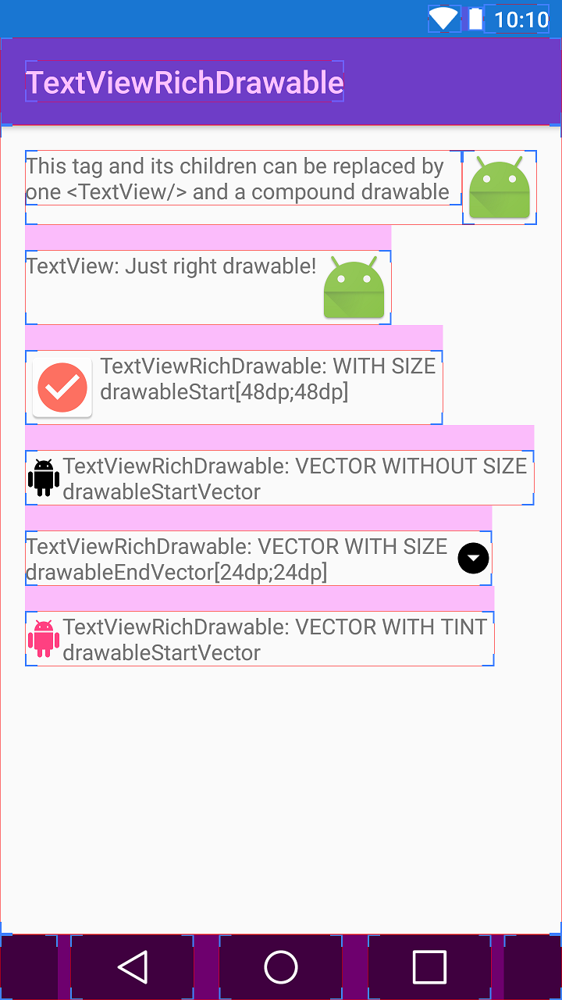

# TextViewRichDrawable

This is a tiny library which empowers TextView's compound drawables with size specifying and vector support.

This library is just an extension of Android's TextView.

## Usage

* In XML layout: 

```xml
    <com.tolstykh.textviewrichdrawable.TextViewRichDrawable
        android:layout_width="wrap_content"
        android:layout_height="wrap_content"
        android:text="Some text"
        app:compoundDrawableHeight="24dp"
        app:compoundDrawableWidth="24dp"
        app:drawableTopVector="@drawable/some_vector_drawble"
        app:drawableEndVector="@drawable/another_vector_drawable" />
```        

* All customizable attributes:

```xml
    <declare-styleable name="TextViewRichDrawable">
        <attr name="compoundDrawableWidth" format="dimension"/>
        <attr name="compoundDrawableHeight" format="dimension"/>
        <attr name="drawableStartVector" format="reference" />
        <attr name="drawableTopVector" format="reference" />
        <attr name="drawableEndVector" format="reference" />
        <attr name="drawableBottomVector" format="reference" />
    </declare-styleable>
```

## Example



## Download

```groovy
repositories {
    jcenter()
}
```

```groovy
compile 'com.tolstykh.textviewrichdrawable:textview-rich-drawable:0.2.0'
```

## License

    Copyright 2016 Oleksandr Tolstykh

    Licensed under the Apache License, Version 2.0 (the "License");
    you may not use this file except in compliance with the License.
    You may obtain a copy of the License at

       http://www.apache.org/licenses/LICENSE-2.0

    Unless required by applicable law or agreed to in writing, software
    distributed under the License is distributed on an "AS IS" BASIS,
    WITHOUT WARRANTIES OR CONDITIONS OF ANY KIND, either express or implied.
    See the License for the specific language governing permissions and
    limitations under the License.